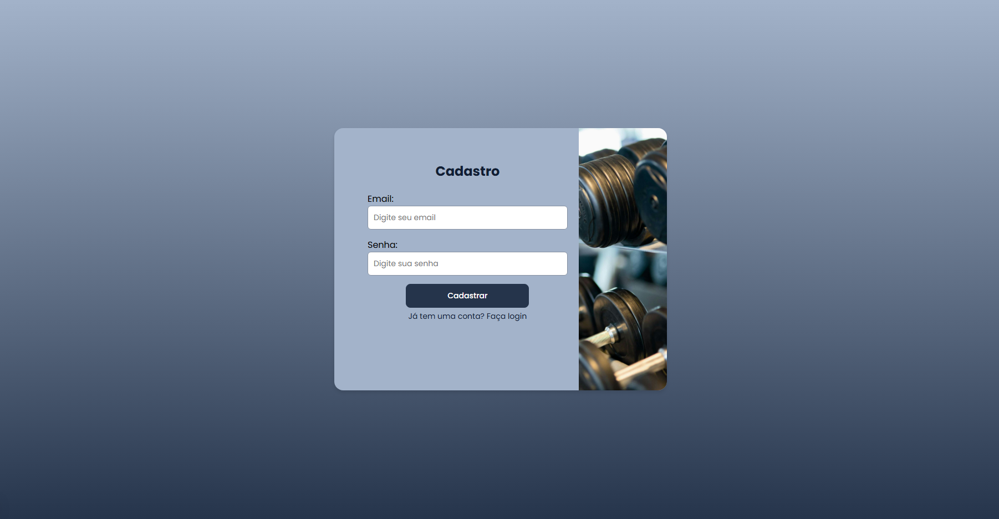

# 💪 Sistema de Login – Projeto Full Stack

Aplicação full stack simples com funcionalidades de **cadastro** e **login** de usuários. O backend foi desenvolvido com **Java + Spring Boot**, e o frontend com **Next.js + React**.

---

## 🧰 Tecnologias Utilizadas

### 🔧 Backend
- Java 17
- Spring Boot
- Maven
- MySQL

### 🖥️ Frontend
- Next.js
- React
- Node.js

---

## 🗂️ Estrutura do Projeto

```
/backend
    ├── src/
    └── pom.xml

/frontend
    ├── pages/
    └── package.json
```

---

## 🚀 Como Executar o Projeto

### 1️⃣ Criar o Banco de Dados

Abra o **MySQL Workbench** e execute o script `login_script.sql` para criar o banco de dados e suas tabelas.

---

### 2️⃣ Rodar o Backend (Spring Boot)

#### ✅ Pré-requisitos
- Java 17 ou superior
- Maven
- MySQL ativo localmente

#### ▶️ Instruções

```bash
cd backend
```

1. Instale as dependências (se necessário):
   ```bash
   mvn clean install
   ```

2. Atualize o arquivo `src/main/resources/application.properties` com suas configurações:
   ```properties
   spring.datasource.url=jdbc:mysql://localhost:3306/login_db
   spring.datasource.username=SEU_USUARIO
   spring.datasource.password=SUA_SENHA
   ```

3. Inicie a aplicação:
   - Pelo terminal:
     ```bash
     mvn spring-boot:run
     ```
   - Ou pela sua IDE (IntelliJ, Eclipse etc.):
     Execute o arquivo `LoginApplication.java`

📡 O backend ficará disponível em: `http://localhost:8080/`

---

### 3️⃣ Rodar o Frontend (Next.js)

#### ✅ Pré-requisitos
- Node.js 18 ou superior

#### ▶️ Instruções

```bash
cd frontend
```

1. Instale as dependências:
   ```bash
   npm install
   ```

2. Inicie o servidor de desenvolvimento:
   ```bash
   npm run dev
   ```

🌐 Acesse a aplicação em: [http://localhost:3000](http://localhost:3000)

---

## 🧪 Como Usar

1. Acesse [http://localhost:3000](http://localhost:3000)
2. Cadastre-se com um e-mail e senha
3. Faça login com as credenciais cadastradas
4. Navegue pela aplicação autenticada

---

## 📷 Capturas de Tela

### Tela de Login


### Tela de Cadastro

